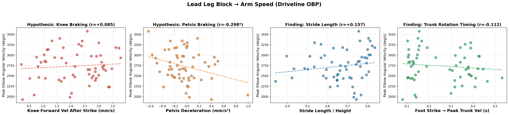
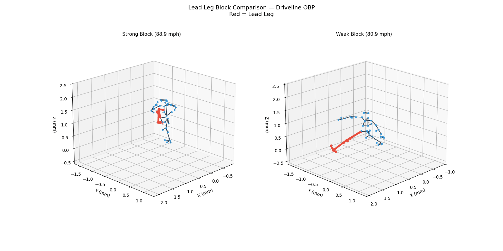
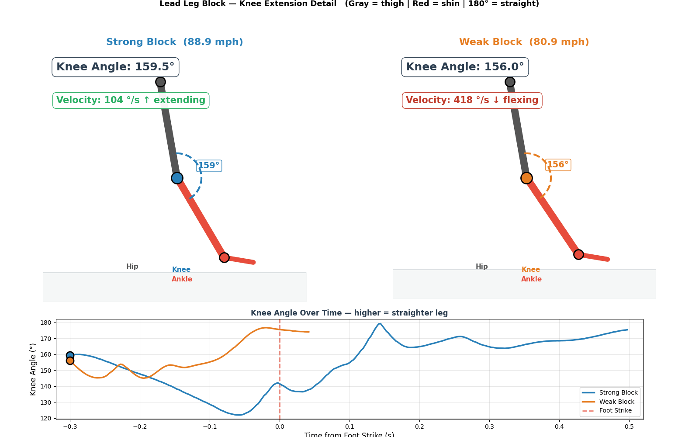

# baseball-cv: Baseball Skeleton Analysis with Computer Vision

Biomechanical skeleton analysis pipeline for baseball pitching and hitting motions. Combines motion capture data (C3D) with computer vision (MediaPipe) to extract joint angles, angular velocities, and correlate body mechanics with performance metrics.

## Pipeline Overview

| Step | Script | Description |
|------|--------|-------------|
| 1 | `skeleton_c3d.py` | Load Driveline OBP C3D files with [ezc3d](https://github.com/pyomeca/ezc3d) → 3D skeleton visualization & animation |
| 2 | `skeleton_video.py` | MediaPipe Pose detection on video → skeleton overlay & keypoint CSV |
| 3 | `skeleton_analysis.py` | Joint angle & angular velocity extraction from C3D data |
| 4 | `statcast_correlation.py` | Skeleton features × pitch speed / exit velocity correlation |
| 5 | `statcast_correlation.py` | Lead Leg Block analysis — foot strike detection, ankle braking & knee extension vs speed |

## Results

### Step 1: 3D Skeleton Visualization (ezc3d)

Driveline OpenBiomechanics Project C3D files loaded with ezc3d and rendered as 3D stick figures.

**Pitching motion** (45 body markers, 360 Hz):


**Hitting motion** (45 body + 10 bat markers, 360 Hz):


> I contributed a bug fix to ezc3d ([PR #384](https://github.com/pyomeca/ezc3d/pull/384)) — fixing an `__eq__` early return bug — and then used the library for this analysis.

### Step 3: Kinematic Sequence

Joint angles extracted from C3D motion capture data across the full pitching/hitting motion.

**Pitching — Joint Angles:**


| Joint | Min | Max | Range |
|-------|-----|-----|-------|
| Elbow Flexion (R) | 50.5° | 156.7° | 106.3° |
| Shoulder Abduction (R) | 4.6° | 117.7° | 113.1° |
| Trunk Rotation | 0.0° | 58.0° | 57.9° |
| Knee Flexion (R) | 99.1° | 163.8° | 64.7° |

**Angular Velocities:**


### Step 4: Body Mechanics → Arm Speed

What body mechanics drive faster arm action? 60 Driveline OBP athletes (71.3–93.1 mph) analyzed.


The strongest correlations with elbow angular velocity (arm speed):

| Feature | r | p | n |
|---|---|---|---|
| Peak Knee Flexion | +0.76 | <0.001 | 60 |
| Min Knee Flexion | -0.65 | <0.001 | 60 |
| Peak Shoulder Abduction | +0.51 | <0.001 | 60 |
| Stride Length / Height | +0.39 | 0.023 | 34 |
| Trunk Rotation Range | +0.36 | 0.005 | 60 |


### Step 5: Lead Leg Block — Hypothesis vs Reality

**Hypothesis**: Pitchers who "block" their lead leg more effectively at foot strike produce higher pitch speed.

**What we tested**: 40+ position-based and angle-based braking metrics — knee-ankle offset, knee forward velocity, pelvis deceleration, ankle braking, head stability, stride length, trunk rotation timing — all projected onto the throwing direction and normalized by body height.

**What we found**: Lead leg braking metrics do NOT strongly correlate with pitch speed (r < 0.34, mostly non-significant). The real pathway is **body mechanics → arm speed**, not directly → pitch speed:



Stride length (relative to height) and trunk rotation timing correlate with arm speed, while position-based braking metrics (knee forward velocity, pelvis deceleration) show weak effects that did not survive increasing the sample size from n=25 to n=35.

**Strong vs Weak Lead Leg Block** — skeleton animation comparison (lead leg in red):



| | Strong Block | Weak Block |
|---|---|---|
| Pitch Speed | 88.9 mph | 80.9 mph |
| Knee Angle at Foot Strike | 141.5° (bent) | 175.5° (nearly straight) |
| Knee Extension After Strike | +37.7° (actively extends) | +0.0° (no extension) |

The animated GIF compares the two most extreme cases (selected by knee extension behavior). While the visual difference is dramatic, the population-level correlation between knee extension and pitch speed is weak — suggesting the extreme cases are outliers, not representative of a general trend.

**Lead Leg Block → Arm Speed** — full-body skeleton with elbow angular velocity graph:



**Key takeaway**: Pitch speed is the final output of a complex chain. Body mechanics (knee flexion, stride length, trunk rotation) directly drive arm speed, but the link from arm speed to pitch speed depends on additional factors (release point, finger mechanics, ball grip) that motion capture alone cannot measure.

> The same functions work for hitting (front foot block → bat speed). Batting analysis is planned for the next phase.

## Setup

```bash
pip install -r requirements.txt
```

### Requirements
- Python 3.9+
- ezc3d >= 1.5
- mediapipe >= 0.10
- opencv-python >= 4.8
- matplotlib, numpy, pandas, scipy

### Data

Sample C3D files are included in `data/raw/`. For the full dataset:
- [Driveline OpenBiomechanics Project](https://github.com/drivelineresearch/openbiomechanics) (CC BY-NC-SA 4.0)

For MediaPipe video demo (Step 2), download a free baseball video from [Pexels](https://www.pexels.com/search/videos/baseball/) and save to `data/videos/`.

## Usage

```bash
# Step 1: C3D skeleton visualization
python skeleton_c3d.py                    # Both pitching & hitting
python skeleton_c3d.py --mode pitching    # Pitching only

# Step 2: MediaPipe video skeleton detection
python skeleton_video.py --input data/videos/batting.mp4

# Step 3: Joint angle analysis
python skeleton_analysis.py --mode pitching
python skeleton_analysis.py --mode hitting

# Step 4-5: Correlation + Lead Leg Block analysis (downloads additional C3D files)
python statcast_correlation.py --mode pitching --download 40
```

## Data Sources & Credits

- **Driveline OpenBiomechanics Project**: https://openbiomechanics.org/ (CC BY-NC-SA 4.0)
- **Pexels**: Free video clips (Pexels License)
- **Baseball Savant / Statcast**: Public leaderboard data

See [DATA_SOURCES.md](DATA_SOURCES.md) for full details and license restrictions.

## License Disclaimer

The Driveline OBP data is licensed under CC BY-NC-SA 4.0 (non-commercial only). Employees or contractors of professional sports organizations are restricted from using this data. This project is for educational and portfolio purposes.
