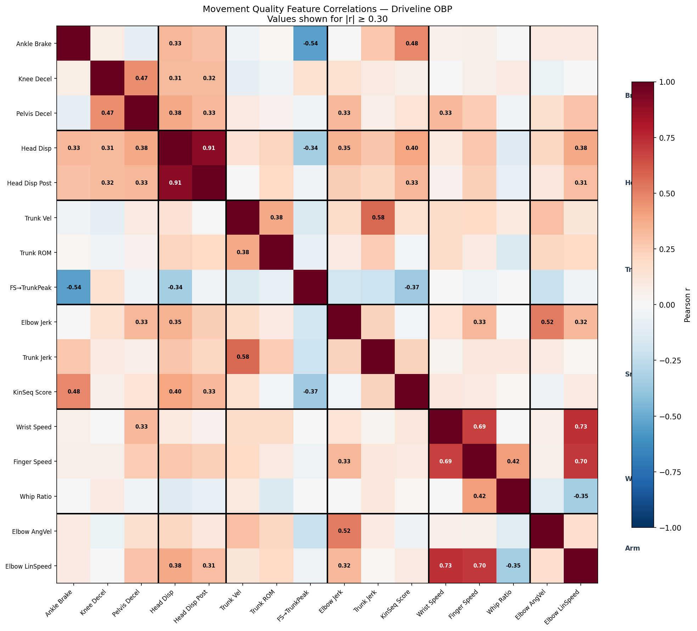
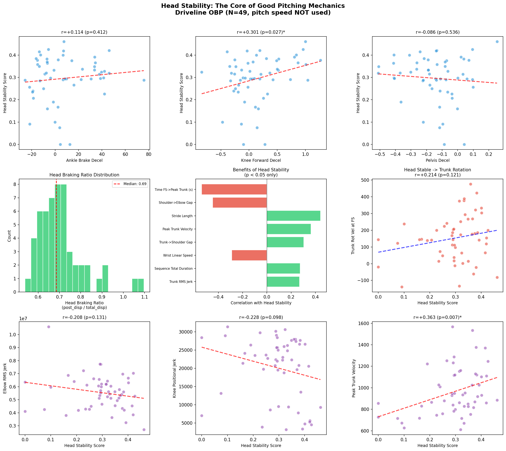
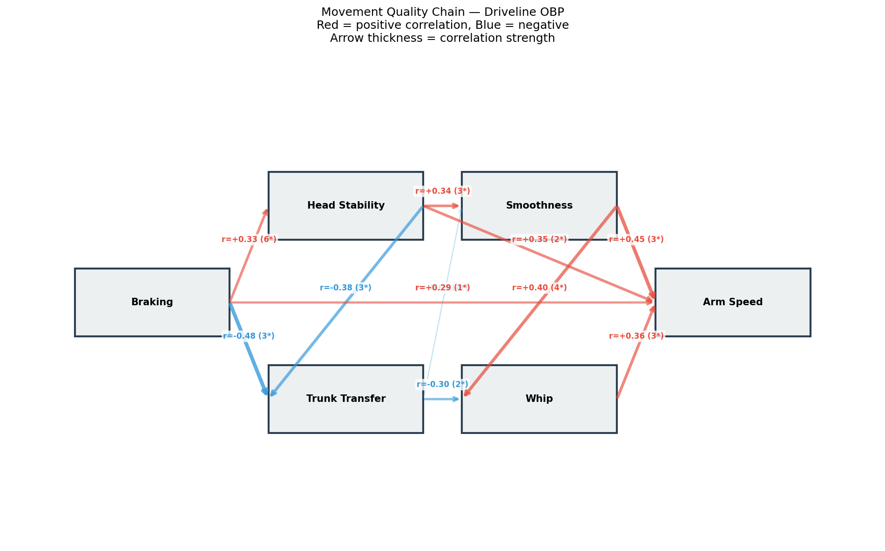

# baseball-cv: Baseball Skeleton Analysis with Computer Vision

Biomechanical skeleton analysis pipeline for baseball pitching and hitting motions. Combines motion capture data (C3D) with computer vision (MediaPipe) to extract joint angles, angular velocities, and correlate body mechanics with performance metrics.

## Pipeline Overview

| Step | Script | Description |
|------|--------|-------------|
| 1 | `skeleton_c3d.py` | Load Driveline OBP C3D files with [ezc3d](https://github.com/pyomeca/ezc3d) → 3D skeleton visualization & animation |
| 2 | `skeleton_video.py` | MediaPipe Pose detection on video → skeleton overlay & keypoint CSV |
| 3 | `skeleton_analysis.py` | Joint angle & angular velocity extraction from C3D data |
| 4 | `statcast_correlation.py` | Multi-athlete biomechanical feature extraction (60 pitchers, auto-detect throwing arm) |
| 5 | `head_stability_analysis.py` | Movement quality chain: braking → head stability → trunk transfer |

## Results

### Step 1: 3D Skeleton Visualization (ezc3d)

Driveline OpenBiomechanics Project C3D files loaded with ezc3d and rendered as 3D stick figures.

**Pitching motion** (45 body markers, 360 Hz):


**Hitting motion** (45 body + 10 bat markers, 360 Hz):


> I contributed a bug fix to ezc3d ([PR #384](https://github.com/pyomeca/ezc3d/pull/384)) — fixing an `__eq__` early return bug — and then used the library for this analysis.

### Step 3: Kinematic Sequence

Joint angles extracted from C3D motion capture data across the full pitching/hitting motion.

**Pitching — Joint Angles:**


| Joint | Min | Max | Range |
|-------|-----|-----|-------|
| Elbow Flexion (R) | 50.5° | 156.7° | 106.3° |
| Shoulder Abduction (R) | 4.6° | 117.7° | 113.1° |
| Trunk Rotation | 0.0° | 58.0° | 57.9° |
| Knee Flexion (R) | 99.1° | 163.8° | 64.7° |

**Angular Velocities:**


### Step 4: Biomechanical Feature Extraction (60 Athletes)

60 Driveline OBP pitchers (71.3–93.1 mph), throwing arm auto-detected by comparing left/right elbow angular velocity. 90+ features extracted per pitcher across 6 categories:

- **Braking**: ankle/knee/pelvis deceleration at foot strike, projected onto throwing direction
- **Head stability**: head forward displacement before/after foot strike
- **Trunk transfer**: trunk rotation velocity, time from foot strike to peak trunk rotation
- **Smoothness**: RMS jerk (elbow, trunk, knee), kinematic sequence timing
- **Whip**: elbow → wrist → finger linear velocity amplification ratio
- **Release**: finger deceleration after peak speed, wrist snap angular velocity



### Step 5: Head Stability — The Core of Pitching Mechanics

Pitch speed is a result, not a cause. We analyzed how body segments transfer energy through the kinetic chain, **without using pitch speed as a target variable**.

**The chain**: Ankle braking → Head stabilizes → Trunk rotation peaks faster



| Link | r | p | n |
|---|---|---|---|
| Ankle braking → Head stability score | **+0.412** | **0.004** | 49 |
| Head stability → Time to peak trunk velocity | **-0.878** | **<0.001** | 49 |

**Why the head matters**: The human head weighs ~5 kg. When the lead foot brakes and the head decelerates, it acts as a stable axis of rotation. The trunk can then rotate efficiently around this fixed point, reaching peak rotational velocity faster. When the head drifts forward, the rotation axis shifts and energy dissipates — force "leaks" instead of transferring up the chain.

**Long vs Short Stride** — skeleton animation comparison (lead leg in red):


**Movement Quality Chain** — correlations between body mechanics categories:



> The same functions work for hitting (front foot block → bat speed). Batting analysis is planned for the next phase.

## Setup

```bash
pip install -r requirements.txt
```

### Requirements
- Python 3.9+
- ezc3d >= 1.5
- mediapipe >= 0.10
- opencv-python >= 4.8
- matplotlib, numpy, pandas, scipy

### Data

Sample C3D files are included in `data/raw/`. For the full dataset:
- [Driveline OpenBiomechanics Project](https://github.com/drivelineresearch/openbiomechanics) (CC BY-NC-SA 4.0)

For MediaPipe video demo (Step 2), download a free baseball video from [Pexels](https://www.pexels.com/search/videos/baseball/) and save to `data/videos/`.

## Usage

```bash
# Step 1: C3D skeleton visualization
python skeleton_c3d.py                    # Both pitching & hitting
python skeleton_c3d.py --mode pitching    # Pitching only

# Step 2: MediaPipe video skeleton detection
python skeleton_video.py --input data/videos/batting.mp4

# Step 3: Joint angle analysis
python skeleton_analysis.py --mode pitching
python skeleton_analysis.py --mode hitting

# Step 4: Feature extraction (downloads additional C3D files)
python statcast_correlation.py --mode pitching --download 40

# Step 5: Head stability chain analysis
python head_stability_analysis.py
```

## Data Sources & Credits

- **Driveline OpenBiomechanics Project**: https://openbiomechanics.org/ (CC BY-NC-SA 4.0)
- **Pexels**: Free video clips (Pexels License)
- **Baseball Savant / Statcast**: Public leaderboard data

See [DATA_SOURCES.md](DATA_SOURCES.md) for full details and license restrictions.

## License Disclaimer

The Driveline OBP data is licensed under CC BY-NC-SA 4.0 (non-commercial only). Employees or contractors of professional sports organizations are restricted from using this data. This project is for educational and portfolio purposes.
