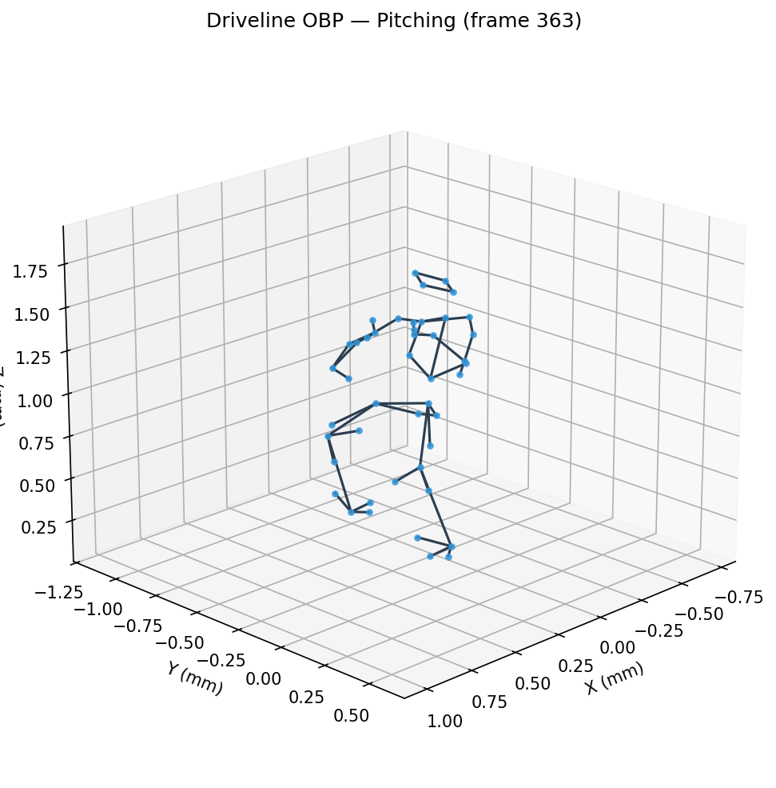
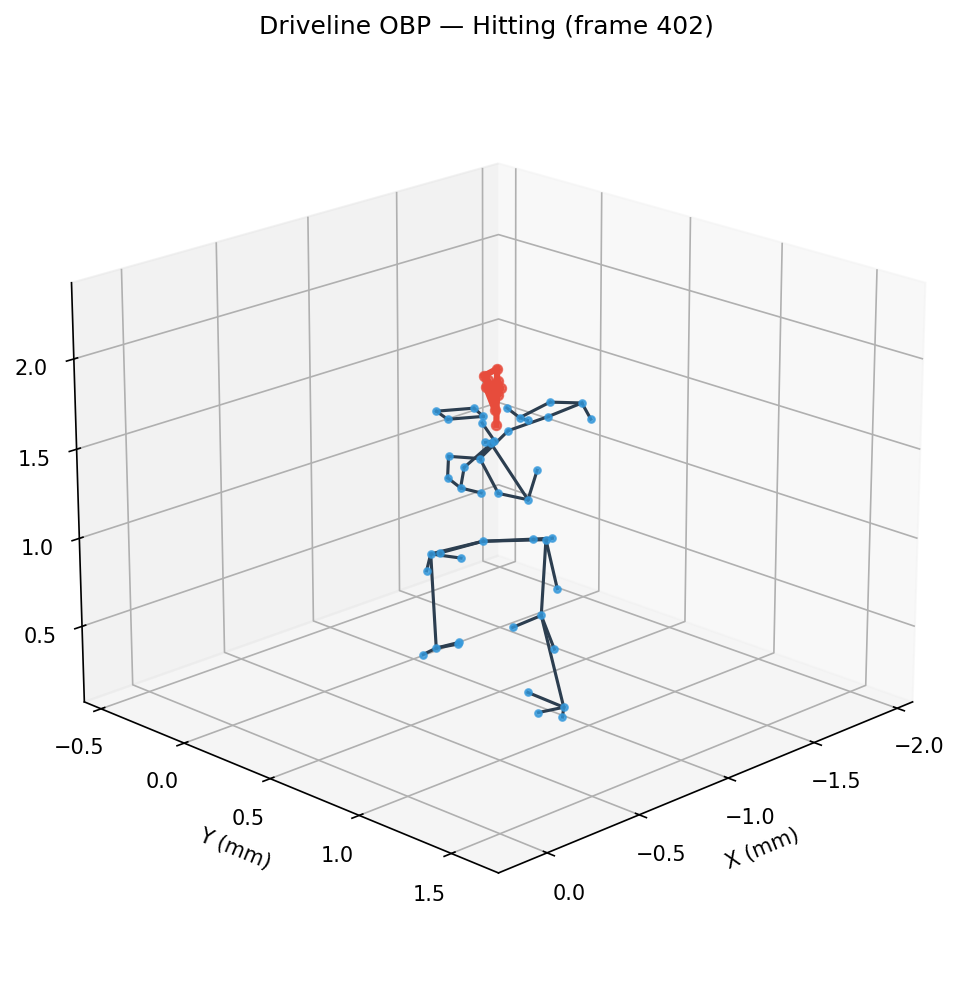
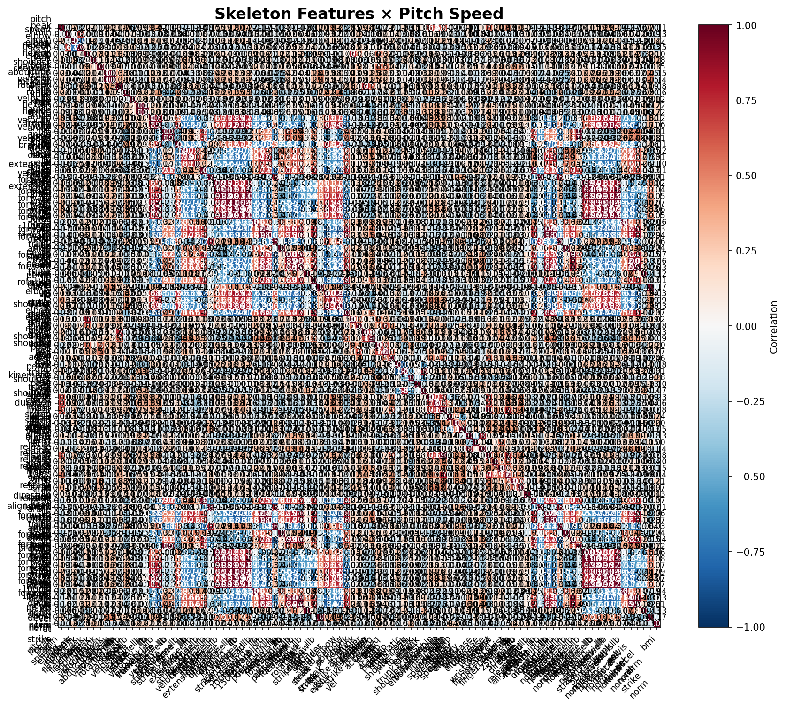
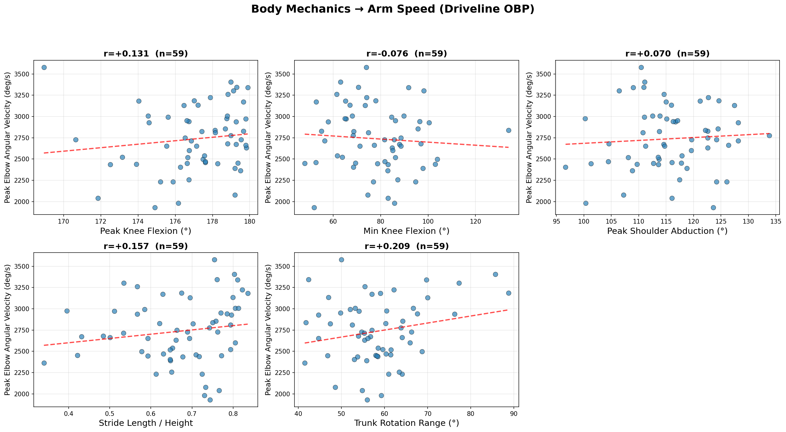

# baseball-cv: Baseball Skeleton Analysis with Computer Vision

Biomechanical skeleton analysis pipeline for baseball pitching and hitting motions. Combines motion capture data (C3D) with computer vision (MediaPipe) to extract joint angles, angular velocities, and correlate body mechanics with performance metrics.

## Pipeline Overview

| Step | Script | Description |
|------|--------|-------------|
| 1 | `skeleton_c3d.py` | Load Driveline OBP C3D files with [ezc3d](https://github.com/pyomeca/ezc3d) → 3D skeleton visualization & animation |
| 2 | `skeleton_video.py` | MediaPipe Pose detection on video → skeleton overlay & keypoint CSV |
| 3 | `skeleton_analysis.py` | Joint angle & angular velocity extraction from C3D data |
| 4 | `statcast_correlation.py` | Skeleton features × pitch speed / exit velocity correlation |

## Results

### Step 1: 3D Skeleton Visualization (ezc3d)

Driveline OpenBiomechanics Project C3D files loaded with ezc3d and rendered as 3D stick figures.

**Pitching motion** (45 body markers, 360 Hz):



**Hitting motion** (45 body + 10 bat markers, 360 Hz):



> I contributed a bug fix to ezc3d ([PR #384](https://github.com/pyomeca/ezc3d/pull/384)) — fixing an `__eq__` early return bug — and then used the library for this analysis.

### Step 3: Kinematic Sequence

Joint angles extracted from C3D motion capture data across the full pitching/hitting motion.

**Pitching — Joint Angles:**


| Joint | Min | Max | Range |
|-------|-----|-----|-------|
| Elbow Flexion (R) | 50.5° | 156.7° | 106.3° |
| Shoulder Abduction (R) | 4.6° | 117.7° | 113.1° |
| Trunk Rotation | 0.0° | 58.0° | 57.9° |
| Knee Flexion (R) | 99.1° | 163.8° | 64.7° |

**Angular Velocities:**


### Step 4: Skeleton Features × Performance Correlation

Correlation between biomechanical features and pitch speed / exit velocity across multiple Driveline OBP athletes.





## Setup

```bash
pip install -r requirements.txt
```

### Requirements
- Python 3.9+
- ezc3d >= 1.5
- mediapipe >= 0.10
- opencv-python >= 4.8
- matplotlib, numpy, pandas, scipy

### Data

Sample C3D files are included in `data/raw/`. For the full dataset:
- [Driveline OpenBiomechanics Project](https://github.com/drivelineresearch/openbiomechanics) (CC BY-NC-SA 4.0)

For MediaPipe video demo (Step 2), download a free baseball video from [Pexels](https://www.pexels.com/search/videos/baseball/) and save to `data/videos/`.

## Usage

```bash
# Step 1: C3D skeleton visualization
python skeleton_c3d.py                    # Both pitching & hitting
python skeleton_c3d.py --mode pitching    # Pitching only

# Step 2: MediaPipe video skeleton detection
python skeleton_video.py --input data/videos/batting.mp4

# Step 3: Joint angle analysis
python skeleton_analysis.py --mode pitching
python skeleton_analysis.py --mode hitting

# Step 4: Correlation analysis (downloads additional C3D files)
python statcast_correlation.py --mode pitching --download 15
```

## Data Sources & Credits

- **Driveline OpenBiomechanics Project**: https://openbiomechanics.org/ (CC BY-NC-SA 4.0)
- **Pexels**: Free video clips (Pexels License)
- **Baseball Savant / Statcast**: Public leaderboard data

See [DATA_SOURCES.md](DATA_SOURCES.md) for full details and license restrictions.

## License Disclaimer

The Driveline OBP data is licensed under CC BY-NC-SA 4.0 (non-commercial only). Employees or contractors of professional sports organizations are restricted from using this data. This project is for educational and portfolio purposes.
