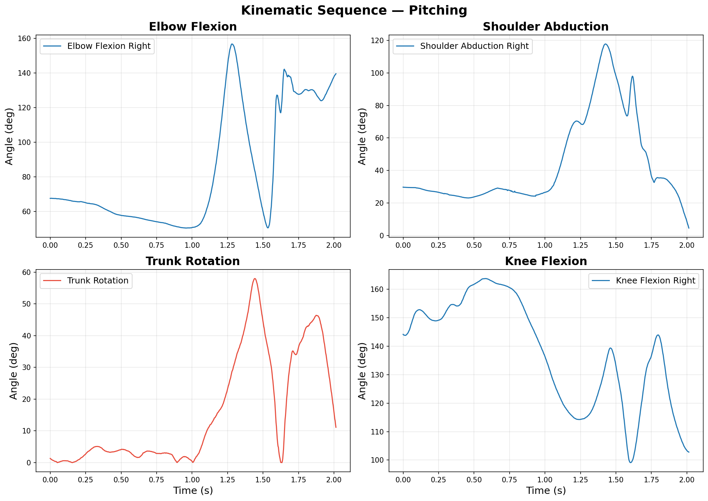
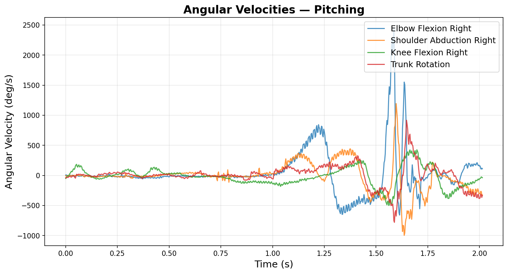
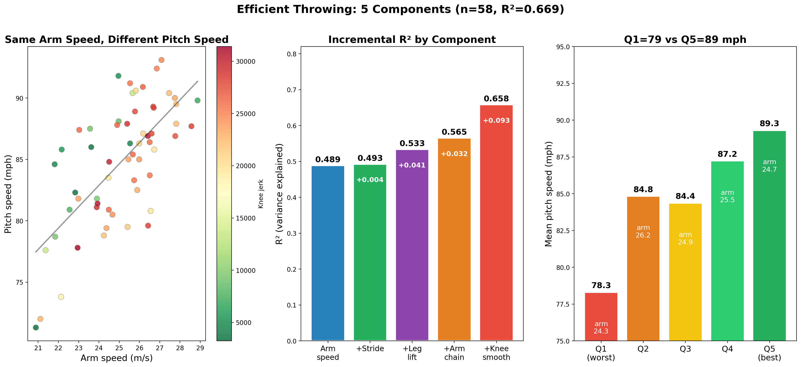
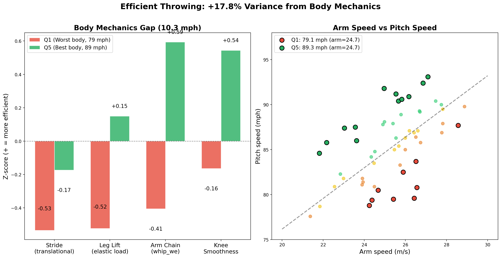
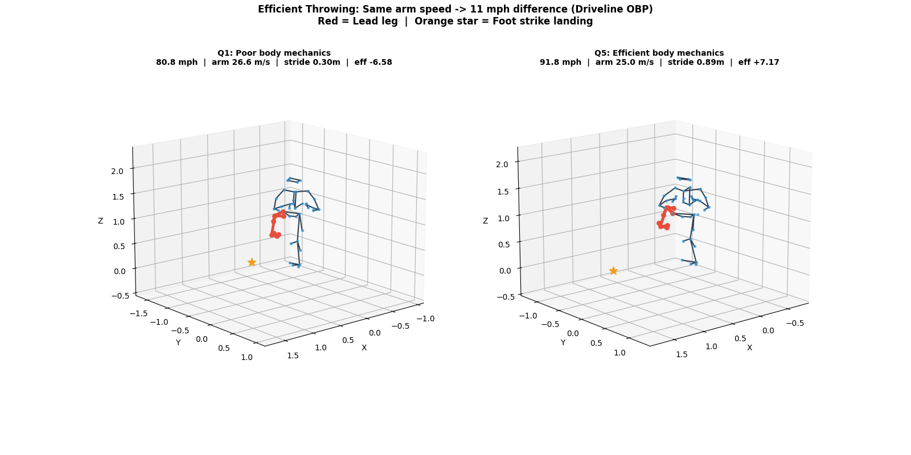

# baseball-cv: Baseball Skeleton Analysis with Computer Vision

Biomechanical skeleton analysis pipeline for baseball pitching and hitting motions. Combines motion capture data (C3D) with computer vision (MediaPipe) to extract joint angles, angular velocities, and correlate body mechanics with performance metrics.

## Pipeline Overview

| Step | Script | Description |
|------|--------|-------------|
| 1 | `skeleton_c3d.py` | Load Driveline OBP C3D files with [ezc3d](https://github.com/pyomeca/ezc3d) → 3D skeleton visualization & animation |
| 2 | `skeleton_video.py` | MediaPipe Pose detection on video → skeleton overlay & keypoint CSV |
| 3 | `skeleton_analysis.py` | Joint angle & angular velocity extraction from C3D data |
| 4 | `statcast_correlation.py` | Feature extraction from C3D: 100 biomechanical features across 60 pitchers |
| 5 | `body_efficiency_analysis.py` `efficient_thrower_gif.py` | **Efficient throwing**: 5-component model (R²=0.491→0.669), same arm speed → 10 mph gap |

## Results

### Step 1: 3D Skeleton Visualization (ezc3d)

Driveline OpenBiomechanics Project C3D files loaded with ezc3d and rendered as 3D stick figures.

**Pitching motion** (45 body markers, 360 Hz):


**Hitting motion** (45 body + 10 bat markers, 360 Hz):


> I contributed a bug fix to ezc3d ([PR #384](https://github.com/pyomeca/ezc3d/pull/384)) — fixing an `__eq__` early return bug — and then used the library for this analysis.

### Step 3: Kinematic Sequence

Joint angles extracted from C3D motion capture data across the full pitching/hitting motion.

**Pitching — Joint Angles:**



| Joint | Min | Max | Range |
|-------|-----|-----|-------|
| Elbow Flexion (R) | 50.5° | 156.7° | 106.3° |
| Shoulder Abduction (R) | 4.6° | 117.7° | 113.1° |
| Trunk Rotation | 0.0° | 58.0° | 57.9° |
| Knee Flexion (R) | 99.1° | 163.8° | 64.7° |

**Angular Velocities:**



### Step 4–5: Efficient Throwing — Body Mechanics Analysis

60 Driveline OBP pitchers analyzed. **Finding**: Pitchers with identical arm speed (24–26 m/s) vary by 13 mph in pitch speed. Four independent body mechanics factors explain 17.8% additional variance beyond arm speed alone.

**5-Component Model (R² = 0.669 vs 0.491 arm-speed-only):**

| Component | R² Added | Physical Meaning |
|-----------|----------|-----------------|
| Arm speed + height | 0.491 | Baseline: wrist linear speed |
| + Stride (translational) | +0.038 | Forward momentum delivered to ball |
| + Leg lift (elastic) | +0.036 | Elastic loading in the back leg |
| + Arm chain pattern | +0.028 | Does body drive the elbow vs arm self-generating? |
| + Knee smoothness | **+0.077** | Smooth lead leg = body drives arm (pelvis/arm ratio) |

**Same arm speed → 10.3 mph gap (Q1=79 mph vs Q5=89 mph):**



**Q1 vs Q5 body mechanics breakdown (arm speed 24.6 vs 24.7 m/s — virtually identical):**



**Skeleton animation** — Q1 (arm=26.6 m/s, pitch=80.8 mph, stride=0.30 m) vs Q5 (arm=25.0 m/s, pitch=91.8 mph, stride=0.89 m):



> **Knee smoothness** is a suppressor variable: raw r=+0.12 (explosive athletes have fast arms AND jerky knees), but after controlling for arm speed: r=−0.45\*\*\* — smooth knee → pelvis/arm ratio 17% higher → body drives the arm rather than the arm self-generating.

> **Root cause of short stride**: low ankle braking (Q1: 0.06 vs Q5: 3.58 m/s²) → foot doesn't create a stable base → stride limited (ankle braking → stride r=+0.55\*\*\*).

## Setup

```bash
pip install -r requirements.txt
```

### Requirements
- Python 3.9+
- ezc3d >= 1.5
- mediapipe >= 0.10
- opencv-python >= 4.8
- matplotlib, numpy, pandas, scipy

### Data

Sample C3D files are included in `data/raw/`. For the full dataset:
- [Driveline OpenBiomechanics Project](https://github.com/drivelineresearch/openbiomechanics) (CC BY-NC-SA 4.0)

For MediaPipe video demo (Step 2), download a free baseball video from [Pexels](https://www.pexels.com/search/videos/baseball/) and save to `data/videos/`.

## Usage

```bash
# Step 1: C3D skeleton visualization
python skeleton_c3d.py                    # Both pitching & hitting
python skeleton_c3d.py --mode pitching    # Pitching only

# Step 2: MediaPipe video skeleton detection
python skeleton_video.py --input data/videos/batting.mp4

# Step 3: Joint angle analysis
python skeleton_analysis.py --mode pitching
python skeleton_analysis.py --mode hitting

# Step 4: Feature extraction (downloads C3D files, builds features_pitching.csv)
python statcast_correlation.py --mode pitching --download 40

# Step 5: Body efficiency analysis
python body_efficiency_analysis.py         # Scatter plots + R2 breakdown
python efficient_thrower_gif.py            # Skeleton animation Q1 vs Q5
```

## Data Sources & Credits

- **Driveline OpenBiomechanics Project**: https://openbiomechanics.org/ (CC BY-NC-SA 4.0)
- **Pexels**: Free video clips (Pexels License)
- **Baseball Savant / Statcast**: Public leaderboard data

See [DATA_SOURCES.md](DATA_SOURCES.md) for full details and license restrictions.

## License Disclaimer

The Driveline OBP data is licensed under CC BY-NC-SA 4.0 (non-commercial only). Employees or contractors of professional sports organizations are restricted from using this data. This project is for educational and portfolio purposes.
