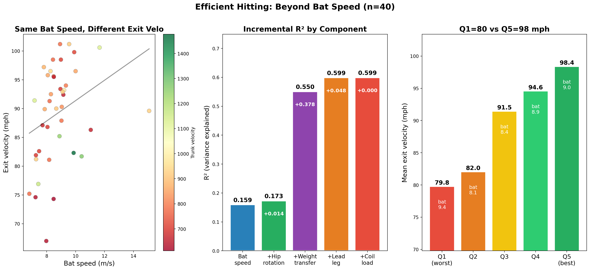
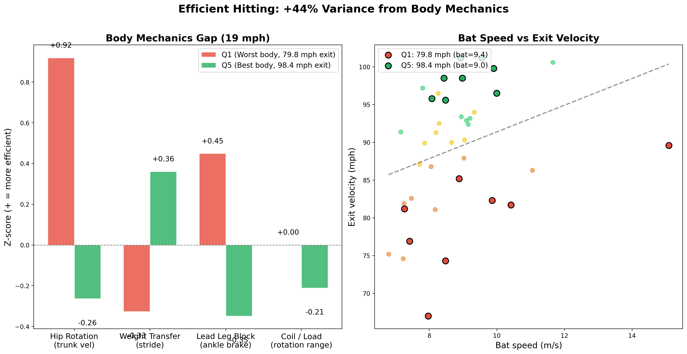

# baseball-cv: Baseball Skeleton Analysis with Computer Vision

Biomechanical skeleton analysis pipeline for baseball pitching and hitting motions. Combines motion capture data (C3D) with computer vision (MediaPipe) to extract joint angles, angular velocities, and correlate body mechanics with performance metrics.

## Pipeline Overview

| Step | Script | Description |
|------|--------|-------------|
| 1 | `skeleton_c3d.py` | Load Driveline OBP C3D files with [ezc3d](https://github.com/pyomeca/ezc3d) → 3D skeleton visualization & animation |
| 2 | `skeleton_video.py` | MediaPipe Pose detection on video → skeleton overlay & keypoint CSV |
| 3 | `skeleton_analysis.py` | Joint angle & angular velocity extraction from C3D data |
| 4 | `statcast_correlation.py` | Feature extraction from C3D: 100 biomechanical features across 60 pitchers |
| 5 | `body_efficiency_analysis.py` `efficient_thrower_gif.py` | **Efficient throwing**: 5-component model (R²=0.491→0.669), same arm speed → 10 mph gap |
| 6 | `body_efficiency_hitting.py` `efficient_hitter_gif.py` | **Efficient hitting**: 40 hitters, weight transfer drives R²+0.378, Q5 hits 18.6 mph harder at similar bat speed and *smaller* body size |

## Articles

| Steps | Title | Links |
|-------|-------|-------|
| 1–3 | 3D Skeleton Detection from Baseball Motion Capture Data | [Zenn](https://zenn.dev/shogaku/articles/baseball-cv-skeleton-biomechanics) · [Qiita](https://qiita.com/yasumorishima/items/1223f01edb8c02abd68f) |
| 4–5 | Why Two Pitchers with the Same Arm Speed Differ by 10 mph | [Zenn](https://zenn.dev/shogaku/articles/baseball-cv-efficient-throwing) · [Qiita](https://qiita.com/yasumorishima/items/aa06d1126b2a8269a132) |
| 6 | Why Two Hitters with the Same Bat Speed Differ by 20 mph in Exit Velocity | *(coming soon)* |

## Results

### Step 1: 3D Skeleton Visualization (ezc3d)

C3D files store 3D marker coordinates captured by optical motion capture. Each frame records the XYZ position of every marker attached to the athlete's body.

- **Pitching data**: 45 markers, 360 Hz, ~726 frames per trial
- **Hitting data**: 55 markers (45 body + 10 bat), 360 Hz, ~804 frames per trial

ezc3d loads the binary C3D format and returns arrays ready for NumPy/matplotlib:

```python
import ezc3d

c3d = ezc3d.c3d("pitching_sample.c3d")
points = c3d["data"]["points"]  # shape: (4, n_markers, n_frames)
labels = c3d["parameters"]["POINT"]["LABELS"]["value"]
```

**Pitching motion** (45 body markers, 360 Hz):


Wind-up → stride → arm acceleration → ball release, rendered as a 3D stick figure.

**Hitting motion** (45 body + 10 bat markers, 360 Hz):


The 10 bat markers (red) are rendered separately from the body skeleton, making bat path visible alongside the hitter's kinematics.

> I contributed a bug fix to ezc3d ([PR #384](https://github.com/pyomeca/ezc3d/pull/384)) — fixing an `__eq__` early return bug — and then used the library for this analysis.

---

### Step 2: Video-Based Skeleton Detection (MediaPipe)

For setups without C3D equipment, Google's MediaPipe Pose detects 33 skeletal landmarks from standard video in real time.

```python
import mediapipe as mp

mp_pose = mp.solutions.pose
pose = mp_pose.Pose(
    static_image_mode=False,
    min_detection_confidence=0.5,
    min_tracking_confidence=0.5
)
```

Outputs a keypoint CSV and an annotated video overlay. Steps 3–5 use C3D data, but MediaPipe is a practical entry point when professional equipment isn't available.

---

### Step 3: Joint Angle & Angular Velocity Extraction

Joint angles (how much each joint opens/closes) and angular velocities (how fast each joint rotates, in degrees/sec) are computed frame-by-frame from the C3D marker positions.

**Pitching — Joint Angles across full motion:**


| Joint | Min | Max | Range |
|-------|-----|-----|-------|
| Elbow Flexion (R) | 50.5° | 156.7° | 106.3° |
| Shoulder Abduction (R) | 4.6° | 117.7° | 113.1° |
| Trunk Rotation | 0.0° | 58.0° | 57.9° |
| Knee Flexion (R) | 99.1° | 163.8° | 64.7° |

Elbow flexion spans ~106° — the arm goes from nearly straight at extension to sharply bent near max external rotation, then extends again at release. Trunk rotation (58°) appears modest by comparison, but emerges as the strongest correlate of pitch velocity in Step 4.

**Angular Velocities — when does each joint move fastest?**


The time-series shows each joint's rotational speed per frame. This reveals the proximal-to-distal kinematic sequence: hips and trunk rotate first, followed by the shoulder, then elbow and wrist.

**Pitch speed correlation (16 pitchers, Step 4 preview):**

| Feature | r | p-value |
|---------|---|---------|
| Peak Trunk Angular Velocity | 0.119 | 0.673 |
| Peak Elbow Angular Velocity | 0.094 | 0.739 |
| Peak Shoulder Abduction | 0.180 | 0.520 |
| **Trunk Rotation Range** | **0.425** | **0.114** |

With 16 samples the p-values don't reach significance, but trunk rotation range shows the strongest correlation (r=0.425). Step 4–5 expand this with 60 pitchers.

> 📝 [3D Skeleton Detection from Baseball Motion Capture Data](https://zenn.dev/shogaku/articles/baseball-cv-skeleton-biomechanics) (Zenn · [Qiita](https://qiita.com/yasumorishima/items/1223f01edb8c02abd68f))

---

### Step 4–5: Efficient Throwing — Body Mechanics Analysis

60 Driveline OBP pitchers analyzed. **Finding**: Pitchers with identical arm speed (24–26 m/s) vary by 13 mph in pitch speed. Four independent body mechanics factors explain 17.8% additional variance beyond arm speed alone.

**5-Component Model (R² = 0.669 vs 0.491 arm-speed-only):**

| Component | R² Added | Physical Meaning |
|-----------|----------|-----------------|
| Arm speed + height | 0.491 | Baseline: wrist linear speed |
| + Stride (translational) | +0.038 | Forward momentum delivered to ball |
| + Leg lift (elastic) | +0.036 | Elastic loading in the back leg |
| + Arm chain pattern | +0.028 | Does body drive the elbow vs arm self-generating? |
| + Knee smoothness | **+0.077** | Smooth lead leg = body drives arm (pelvis/arm ratio) |

**Same arm speed → 10.3 mph gap (Q1=79 mph vs Q5=89 mph):**


**Q1 vs Q5 body mechanics breakdown (arm speed 24.6 vs 24.7 m/s — virtually identical):**


**Skeleton animation** — Q1 (arm=26.6 m/s, pitch=80.8 mph, stride=0.30 m) vs Q5 (arm=25.0 m/s, pitch=91.8 mph, stride=0.89 m):


> **Knee smoothness** is a suppressor variable: raw r=+0.12 (explosive athletes have fast arms AND jerky knees), but after controlling for arm speed: r=−0.45\*\*\* — smooth knee → pelvis/arm ratio 17% higher → body drives the arm rather than the arm self-generating.

> **Root cause of short stride**: low ankle braking (Q1: 0.06 vs Q5: 3.58 m/s²) → foot doesn't create a stable base → stride limited (ankle braking → stride r=+0.55\*\*\*).

> 📝 [Why Two Pitchers with the Same Arm Speed Differ by 10 mph](https://zenn.dev/shogaku/articles/baseball-cv-efficient-throwing) (Zenn · [Qiita](https://qiita.com/yasumorishima/items/aa06d1126b2a8269a132))

---

### Step 6: Efficient Hitting — Body Mechanics Analysis

40 Driveline OBP hitters analyzed. **Finding**: Bat speed alone barely predicts exit velocity (R²=0.097). Adding weight transfer (stride) alone jumps R² to 0.550 (+0.378) — the single largest factor. The top 20% of body efficiency hitters produce 20.9 mph more exit velocity despite having *lower* bat speed than the bottom 20%.

**4-Component Model (R² = 0.159 → 0.599):**

| Component | R² | Added | Physical Meaning |
|-----------|-----|-------|-----------------|
| Bat speed + height | 0.159 | baseline | Wrist linear speed at contact |
| + Hip rotation | 0.173 | +0.014 | Trunk rotational velocity driving the swing |
| **+ Weight transfer** | **0.550** | **+0.378** | **Stride length — forward momentum into the ball** |
| + Lead leg block | 0.599 | +0.048 | Ankle braking creates a stable base to rotate around |

> **Weight transfer dominates**: stride length adds 37.8% of explained variance in a single step. A longer, controlled stride channels the body's forward momentum into rotational power at contact.

**Q5 hitters produce 18.6 mph more — at similar bat speed and body size:**

| Group | Bat speed | Height | Weight | Exit velocity | Gap |
|-------|-----------|--------|--------|--------------|-----|
| Q1 (bottom 20%) | 9.42 m/s | 70.8 in | 196.0 lb | 79.8 mph | — |
| Q5 (top 20%) | 9.04 m/s | **69.9 in** | **191.9 lb** | **98.4 mph** | **+18.6 mph** |

The efficiency score controls for bat speed, height, and weight together — so Q1/Q5 groups are matched on physique. Q5 hitters are actually *shorter and lighter* yet produce 18.6 mph more exit velocity. The gap is mechanics, not size.

**Story plot** (scatter colored by hip rotation speed | R² staircase | Q1–Q5 bars):



**Body mechanics breakdown** (Q1 vs Q5 z-scores at virtually identical bat speed):



**Skeleton animation** — Q1 (bat=7.23 m/s, 打球速度=74.6 mph, stride=0.72 m) vs Q5 (bat=7.80 m/s, 打球速度=97.2 mph, stride=0.99 m):


Red = lead leg (front foot/stride leg). Orange star = foot strike landing point. Both clips are aligned to foot strike.

> **体効率スコア (Body Efficiency Score)**: Residual of exit velocity after controlling for bat speed, height, and weight together. A score of +9.70 mph means this hitter produces 9.7 mph *more* exit velocity than a hitter of the same size and bat speed — purely from body mechanics.

> **Root cause of short stride**: low ankle braking deceleration → foot fails to create a stable braking base → stride is curtailed → less forward momentum transfers into rotation at contact.

## Setup

```bash
pip install -r requirements.txt
```

### Requirements
- Python 3.9+
- ezc3d >= 1.5
- mediapipe >= 0.10
- opencv-python >= 4.8
- matplotlib, numpy, pandas, scipy

### Data

Sample C3D files are included in `data/raw/`. For the full dataset:
- [Driveline OpenBiomechanics Project](https://github.com/drivelineresearch/openbiomechanics) (CC BY-NC-SA 4.0)

For MediaPipe video demo (Step 2), download a free baseball video from [Pexels](https://www.pexels.com/search/videos/baseball/) and save to `data/videos/`.

## Usage

```bash
# Step 1: C3D skeleton visualization
python skeleton_c3d.py                    # Both pitching & hitting
python skeleton_c3d.py --mode pitching    # Pitching only

# Step 2: MediaPipe video skeleton detection
python skeleton_video.py --input data/videos/batting.mp4

# Step 3: Joint angle analysis
python skeleton_analysis.py --mode pitching
python skeleton_analysis.py --mode hitting

# Step 4: Feature extraction (downloads C3D files, builds features_pitching.csv)
python statcast_correlation.py --mode pitching --download 40

# Step 5: Body efficiency analysis (pitching)
python body_efficiency_analysis.py         # Scatter plots + R2 breakdown
python efficient_thrower_gif.py            # Skeleton animation Q1 vs Q5

# Step 6: Body efficiency analysis (hitting)
python statcast_correlation.py --mode hitting --download 40
python body_efficiency_hitting.py          # Scatter plots + R2 breakdown
python efficient_hitter_gif.py             # Skeleton animation Q1 vs Q5
```

## Data Sources & Credits

- **Driveline OpenBiomechanics Project**: https://openbiomechanics.org/ (CC BY-NC-SA 4.0)
- **Pexels**: Free video clips (Pexels License)
- **Baseball Savant / Statcast**: Public leaderboard data

See [DATA_SOURCES.md](DATA_SOURCES.md) for full details and license restrictions.

## License Disclaimer

The Driveline OBP data is licensed under CC BY-NC-SA 4.0 (non-commercial only). Employees or contractors of professional sports organizations are restricted from using this data. This project is for educational and portfolio purposes.
